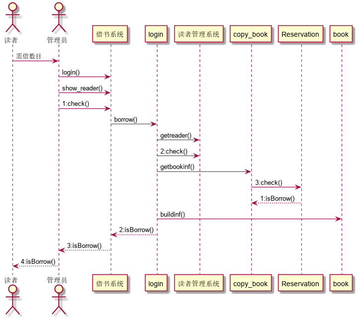

# 实验4：图书管理系统顺序图绘制
## 图书管理系统的顺序图
### 1. 借书用例
### 1.1借书用例PlantUML源码
```angular2
@startuml
actor 读者
actor 管理员
读者->管理员:需借数目
管理员->借书系统:login()
管理员->借书系统:show_reader()
管理员->借书系统:1:check()
借书系统->login:borrow()
login->读者管理系统:getreader()
login->读者管理系统:2:check()
login->copy_book:getbookinf()
copy_book->Reservation:3:check()
Reservation-->copy_book:1:isBorrow()
login->book:buildinf()
login-->借书系统:2:isBorrow()
借书系统-->管理员:3:isBorrow()
管理员-->读者:4:isBorrow()
@enduml
```
### 1.2借书用例顺序图

### 1.3. 借书用例顺序图说明
```angular2
1、login（）：读者将需借书目交给管理员，管理员登陆系统。
2、show_reader()：显示读者的信息的函数。
3、check（）：验证读者是否有借书的权利。
4、borrow（）：读者借书函数。
5、getreader（）：获取读者信息的函数。
6、check（）：检验读者是否符合借书条件函数。
7、getbookinf（）：获取书目信息函数。
8、check（）：检查书籍是否被预约的函数。
9、isBorrow()：返回未被预约函数。
10、builtinf()：建立借阅信息函数。
11、isBorrow()：返回借阅信息函数。
12、isBorrow():返回借阅成功函数。
13、isBorrow：借阅成功，将书交给读者。
```
### 2.还书用例
### 2.1. 还书用例PlantUML源码
```angular2
@startuml
actor 读者
actor 管理员
读者->管理员:还书
管理员->还书界面:login()
还书界面->book:getbookinf()
还书界面->loan:getborrowinf()
还书界面->loan:getborrowDate()
还书界面->loan:getnowDate()
还书界面->loan:isOverDate()
还书界面->loan:work()
loan-->还书界面:return
还书界面-->管理员:return
destroy 管理员
@enduml
```
### 2.2还书用例顺序图

### 2.3. 还书用例顺序图说明
```angular2
1、login（）：读者将书籍交给管理员，管理员登录系统。
2、getbookinf（）：管理员扫描条形码，获取书籍信息函数。
3、getborrowinf（）：获取借阅信息函数。
4、getborrowDate（）：获取借阅时间函数。
5、getnowDate（）：获取现在时间函数。
6、isOverDate():是否超出借阅时间函数。
7、work（）：处理函数，处理时间差。
8、return：消息返回。
```
### 3.预约用例
### 3.1. 预约用例PlantUML源码
```angular2
@startuml
actor 读者
读者->图书管理系统:login()
图书管理系统->book:getbookinf()
图书管理系统->copy_book:check()
copy_book->Reservation:reservation()
copy_book->Reservation:getbook()
copy_book->Reservation:build()
Reservation-->图书管理系统
图书管理系统->读者:return result
@enduml
```
### 3.2预约用例顺序图

### 3.3. 预约用例顺序图说明
```angular2
1、login（）：登录系统。
2、getbookinf（）：获取图书信息函数。
3、check（）：检查是否有图书可借函数。
4、reservation（）：确定预约图书函数。
5、getboook（）：获取预约图书信息函数。
6、built（）：建立预约信息函数。
7、return：消息返回
```
