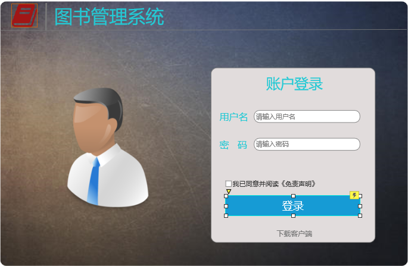
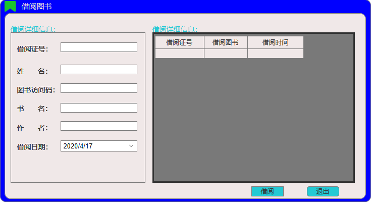
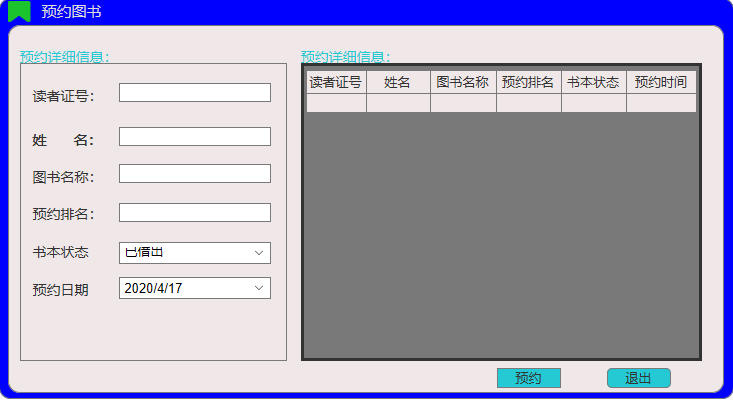
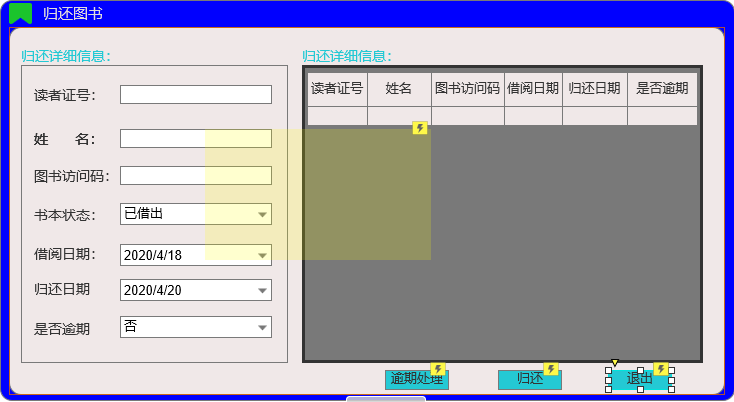
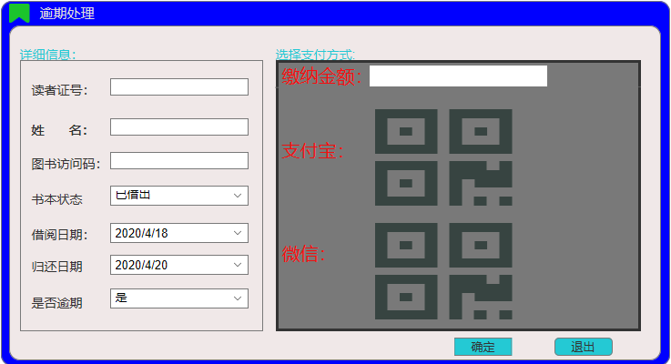
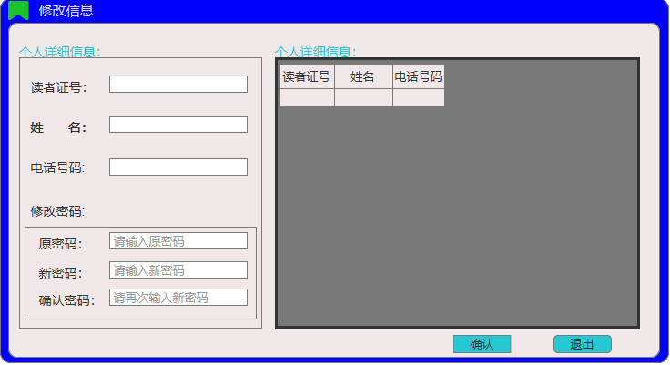

# 实验5：图书管理系统数据库设计与界面设计
## 1.数据库表设计
### 1.1图书表
<table>
<tr>
 <td>字段</td>
 <td>类型</td>
 <td>主键,外键</td>
 <td>可以为空</td>
 <td>默认值</td>
 <td>约束</td>
 <td>说明</td>
</tr>
<tr>
   <td>BookID</td>
   <td>varchar10</td>
   <td>主键</td>
   <td>否</td>
   <td></td>
   <td>主键</td>
   <td>书号</td>
</tr>
<tr>
   <td>BookName</td>
   <td>varchar10</td>
   <td></td>
   <td>否</td>
   <td></td>
   <td></td>
   <td>书名</td>
</tr>
<tr>
   <td>PublishCode</td>
   <td>varchar10</td>
   <td></td>
   <td>否</td>
   <td></td>
   <td></td>
   <td>出版号</td>
</tr>
<tr>
   <td>PublisherName</td>
   <td>varchar10</td>
   <td></td>
   <td>否</td>
   <td></td>
   <td></td>
   <td>出版社名</td>
</tr>
<tr>
   <td>author</td>
   <td>varchar10</td>
   <td></td>
   <td>是</td>
   <td></td>
   <td></td>
   <td>作者</td>
</tr>
</table>

### 1.2读者表
<table>
<tr>
 <td>字段</td>
 <td>类型</td>
 <td>主键,外键</td>
 <td>可以为空</td>
 <td>默认值</td>
 <td>约束</td>
 <td>说明</td>
</tr>
<tr>
   <td>CardID</td>
   <td>varchar10</td>
   <td>主键</td>
   <td>否</td>
   <td></td>
   <td>主键</td>
   <td>读者号</td>
</tr>
<tr>
   <td>Name</td>
   <td>varchar10</td>
   <td></td>
   <td>否</td>
   <td></td>
   <td></td>
   <td>姓名</td>
</tr>
<tr>
   <td>Sex</td>
   <td>varchar10</td>
   <td></td>
   <td>否</td>
   <td></td>
   <td></td>
   <td>性别</td>
</tr>
<tr>
   <td>Dept</td>
   <td>varchar10</td>
   <td></td>
   <td>是</td>
   <td></td>
   <td></td>
   <td>部门</td>
</tr>
</table>

### 1.3借还表
<table>
<tr>
 <td>字段</td>
 <td>类型</td>
 <td>主键,外键</td>
 <td>可以为空</td>
 <td>默认值</td>
 <td>约束</td>
 <td>说明</td>
</tr>
<tr>
   <td>CardID</td>
   <td>varchar10</td>
   <td>外键</td>
   <td>否</td>
   <td></td>
   <td>外键</td>
   <td>读者号</td>
</tr>
<tr>
   <td>BookID</td>
   <td>varchar10</td>
   <td></td>
   <td>否</td>
   <td></td>
   <td></td>
   <td>书号</td>
</tr>
<tr>
   <td>Name</td>
   <td>varchar10</td>
   <td></td>
   <td>否</td>
   <td></td>
   <td></td>
   <td>姓名</td>
</tr>
<tr>
   <td>BorrowDtae</td>
   <td>datetime</td>
   <td></td>
   <td>否</td>
   <td></td>
   <td></td>
   <td>借书日期</td>
</tr>
<tr>
   <td>BackDtae</td>
   <td>datetime</td>
   <td></td>
   <td>否</td>
   <td></td>
   <td></td>
   <td>还书日期</td>
</tr>
</table>

### 1.4预约表
<table>
<tr>
 <td>字段</td>
 <td>类型</td>
 <td>主键,外键</td>
 <td>可以为空</td>
 <td>默认值</td>
 <td>约束</td>
 <td>说明</td>
</tr>
<tr>
   <td>CardID</td>
   <td>varchar10</td>
   <td>外键</td>
   <td>否</td>
   <td></td>
   <td>外键</td>
   <td>读者号</td>
</tr>
<tr>
   <td>Name</td>
   <td>varchar10</td>
   <td></td>
   <td>否</td>
   <td></td>
   <td></td>
   <td>姓名</td>
</tr>
<tr>
   <td>Pdate</td>
   <td>datetime</td>
   <td></td>
   <td>否</td>
   <td></td>
   <td></td>
   <td>预约时间</td>
</tr>
<tr>
   <td>BookID</td>
   <td>varchar10</td>
   <td></td>
   <td>否</td>
   <td></td>
   <td></td>
   <td>书号</td>
</tr>
<tr>
   <td>BookName</td>
   <td>varchar10</td>
   <td></td>
   <td>否</td>
   <td></td>
   <td></td>
   <td>书名</td>
</tr>
</table>

## 2.界面设计
### 2.1登陆界面设计([链接](https://201710414222.github.io/is_analysis_pages/ui/index.html))

- 用例图参见：登录用例
- 类图参见：管理员类，读者类
- 顺序图参见：所有图的login()
- API接口如下：

1.登录
- 功能:登录用户
- 请求地址：http://xybbook/v1/api/login
- 请求方法：GET
- 请求参数：
<table>
<tr>
<td>参数名称</td>
<td>必填</td>
<td>说明</td>
</tr>
<tr>
<td>access_token</td>
<td>是</td>
<td>用于验证请求合法性的认证信息。</td>
</tr>
<tr>
<td>method</td>
<td>是</td>
<td>固定未"GET"</td>
</tr>
</table>

- 返回实例:
```angular2
{
  "user": "username，password",
    "code": 200
}
```
- 返回参数说明:
<table>
<tr>
<td>参数名称</td>
<td>说明</td>
</tr>
<tr>
<td>user</td>
<td>返回类型为user的登陆对象的信息</td>
</tr>
<tr>
<td>code</td>
<td>返回码</td>
</tr>

</table>

### 2.2主界面设计([链接](https://201710414222.github.io/is_analysis_pages/ui/主界面.html))


- 类图参见：管理员类，读者类
- 顺序图参见：所有图
- API接口如下：

1.获取全部分类
- 功能:登陆主界面
- 请求地址：http://xybbook/v1/api/user
- 请求方法：PUT
- 请求参数：
<table>
<tr>
<td>参数名称</td>
<td>必填</td>
<td>说明</td>
</tr>
<tr>
<td>access_token</td>
<td>是</td>
<td>用于验证请求合法性的认证信息。</td>
</tr>
<tr>
<td>method</td>
<td>是</td>
<td>PUT</td>
</tr>
</table>

- 返回实例:
```angular2
{
    "info": "登录成功",
    "data": {
        "ReaderID": "001",
        "ReaderName": "小明",
        "ReaderSex": "男",
        "ReaderDate": "2020.4.25",
        "ReaderPassword": "201610478445",
      },
       
    "code": 200
}
```
- 返回参数说明:
<table>
<tr>
<td>参数名称</td>
<td>说明</td>
</tr>
<tr>
<td>info</td>
<td>返回信息</td>
</tr>
<tr>
<td>data</td>
<td>用户的个人信息</td>
</tr>
<tr>
<td>code</td>
<td>返回码</td>
</tr>
</table>

### 2.3借阅界面设计([链接](https://201710414222.github.io/is_analysis_pages/ui/借阅页面.html))

- 类图参见：管理员类，读者类
- 顺序图参见：书籍借阅图
- API接口如下：

1.书籍借阅
- 功能:借阅
- 请求地址：http://xybbook/v1/api/book
- 请求方法：PUT
- 请求参数：
<table>
<tr>
<td>参数名称</td>
<td>必填</td>
<td>说明</td>
</tr>
<tr>
<td>access_token</td>
<td>是</td>
<td>用于验证请求合法性的认证信息。</td>
</tr>
<tr>
<td>method</td>
<td>是</td>
<td>PUT</td>
</tr>
</table>

- 返回实例:
```angular2

{
    "info": "借阅成功",
    "BookData": {
        "BookID": "465854979",
      
        "BookName": "金牌讲师罗志祥带你规划时间",
        "author": "罗志祥",
        "PublisherName": "上海出版社",
        "PublishCode": "146",
      },
      "ReaderID":"2016104789",
     "LBnum":"5",
    "borrow":{
         "ReaderID":"2016104789", 
         "BookID": "465854979",
         "BookName": "金牌讲师罗志祥带你规划时间"                      
     },
       
    "code": 200
}
```
- 返回参数说明:
<table>
<tr>
<td>参数名称</td>
<td>说明</td>
</tr>
<tr>
<td>info</td>
<td>返回信息</td>
</tr>
<tr>
<td>BookData</td>
<td>图书信息</td>
</tr>
<tr>
<td>ReaderID</td>
<td>读者学号</td>
</tr>
<tr>
<td>LBnum</td>
<td>读者允许借阅图书最大数</td>
</tr>
<tr>
<td>borrow</td>
<td>生成借阅信息</td>
</tr>
<tr>
<td>code</td>
<td>返回码</td>
</tr>
</table>

### 2.4预约界面设计([链接](https://201710414222.github.io/is_analysis_pages/ui/预约页面.html))

- 类图参见：管理员类，读者类
- 顺序图参见：书籍预约图
- API接口如下：

1.书籍预约
- 功能:预约
- 请求地址：http://xybbook/v1/api/book?id=
- 请求方法：PUT
- 请求参数：
<table>
<tr>
<td>参数名称</td>
<td>必填</td>
<td>说明</td>
</tr>
<tr>
<td>access_token</td>
<td>是</td>
<td>用于验证请求合法性的认证信息。</td>
</tr>
<tr>
<td>method</td>
<td>是</td>
<td>PUT</td>
</tr>
</table>

- 返回实例:
```angular2

{
    "info": "借阅成功",
    "BookData": {
        "BookID": "469",
        "BookName": "三个孩子",
        "author": "小王",
        "PublisherName": "上海出版社",
        "PublishCode": "234",
      },
      "ReaderID":"2016104789",
     "DZnum":"86",
    "borrow":{
         "ReaderID":"2016104789", 
         "BookID": "469",
         "BookName": "三个孩子"                      
     },
       
    "code": 200
}
```
- 返回参数说明:
<table>
<tr>
<td>参数名称</td>
<td>说明</td>
</tr>
<tr>
<td>info</td>
<td>返回信息</td>
</tr>
<tr>
<td>BookData</td>
<td>图书信息</td>
</tr>
<tr>
<td>ReaderID</td>
<td>读者学号</td>
</tr>
<tr>
<td>DZnum</td>
<td>读者预约排名</td>
</tr>
<tr>
<td>borrow</td>
<td>生成预约信息</td>
</tr>
<tr>
<td>code</td>
<td>返回码</td>
</tr>
</table>

### 2.5还书界面设计([链接](https://201710414222.github.io/is_analysis_pages/ui/还书页面.html))


- 类图参见：管理员类，读者类
- 顺序图参见：书籍还书图
- API接口如下：

1.书籍归还
- 功能:归还
- 请求地址：http://xybbook/v1/api/book?id=
- 请求方法：PUT
- 请求参数：
<table>
<tr>
<td>参数名称</td>
<td>必填</td>
<td>说明</td>
</tr>
<tr>
<td>access_token</td>
<td>是</td>
<td>用于验证请求合法性的认证信息。</td>
</tr>
<tr>
<td>method</td>
<td>是</td>
<td>PUT</td>
</tr>
</table>

- 返回实例:
```angular2

{
    "info": "归还成功",
    "BookData": {
        "BookID": "469",
        "BookName": "三个孩子",
        "author": "小王",
        "PublisherName": "上海出版社",
        "PublishCode": "234",
      },
      "ReaderID":"2016104789",
      "isOutDate":"false""true",
    "code": 200
}
```
- 返回参数说明:
<table>
<tr>
<td>参数名称</td>
<td>说明</td>
</tr>
<tr>
<td>info</td>
<td>返回信息</td>
</tr>
<tr>
<td>BookData</td>
<td>图书信息</td>
</tr>
<tr>
<td>ReaderID</td>
<td>读者学号</td>
</tr>
<tr>
<td>isOutDate</td>
<td>是否逾期</td>
<tr>
<td>code</td>
<td>返回码</td>
</tr>
</table>

### 2.6逾期处理界面设计([链接](https://201710414222.github.io/is_analysis_pages/ui/逾期处理页面.html))

- API接口如下：

1.逾期处理
- 功能:逾期处理
- 请求地址：http://xybbook/v1/api/user?id=
- 请求方法：PUT
- 请求参数：
<table>
<tr>
<td>参数名称</td>
<td>必填</td>
<td>说明</td>
</tr>
<tr>
<td>access_token</td>
<td>是</td>
<td>用于验证请求合法性的认证信息。</td>
</tr>
<tr>
<td>method</td>
<td>是</td>
<td>PUT</td>
</tr>
</table>

- 返回实例:
```angular2

{
    "info": "归还成功",
    "BookData": {
        "BookID": "469",
        "BookName": "三个孩子",
        "author": "小王",
        "PublisherName": "上海出版社",
        "PublishCode": "234",
      },
      "turnmoney":"56",
       "bookstatu":"归还""未缴纳",
      "ReaderID":"2016104789",
      "isOutDate":"false""true",
    "code": 200
}
```
- 返回参数说明:
<table>
<tr>
<td>参数名称</td>
<td>说明</td>
</tr>
<tr>
<td>info</td>
<td>返回信息</td>
</tr>
<tr>
<td>BookData</td>
<td>图书信息</td>
</tr>
<tr>
<td>turnmoney</td>
<td>缴纳金额</td>
</tr>
<tr>
<td>bookstatu</td>
<td>书籍状态</td>
</tr>
<tr>
<td>ReaderID</td>
<td>读者学号</td>
</tr>
<tr>
<td>isOutDate</td>
<td>是否逾期</td>
<tr>
<td>code</td>
<td>返回码</td>
</tr>
</table>

### 2.7修改个人信息界面设计([链接](https://201710414222.github.io/is_analysis_pages/ui/修改信息页面.html))

- 类图参见：管理员类，读者类

- API接口如下：

1.修改信息
- 功能:信息修改
- 请求地址：http://xybbook/v1/api/updateuser
- 请求方法：PUT
- 请求参数：
<table>
<tr>
<td>参数名称</td>
<td>必填</td>
<td>说明</td>
</tr>
<tr>
<td>access_token</td>
<td>是</td>
<td>用于验证请求合法性的认证信息。</td>
</tr>
<tr>
<td>method</td>
<td>是</td>
<td>PUT</td>
</tr>
</table>

- 返回实例:
```angular2

{
    "user": {
       "ReaderID":"2016104789",
         "username":"学习",
         "usernum":"267879",
         "password":"652561"
      },
      "isEqualpassword":"false""true",
      "code":"200",
}
```
- 返回参数说明:
<table>
<tr>
<td>参数名称</td>
<td>说明</td>
</tr>
<tr>
<td>user</td>
<td>用户信息</td>
</tr>
<tr>
<td>isEqualpassword</td>
<td>密码是否相等</td>
</tr>
<tr>
<td>code</td>
<td>返回码</td>
</tr>
</table>
